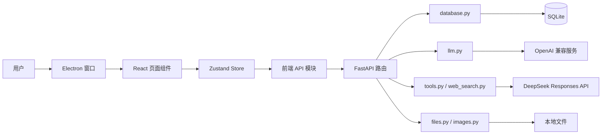
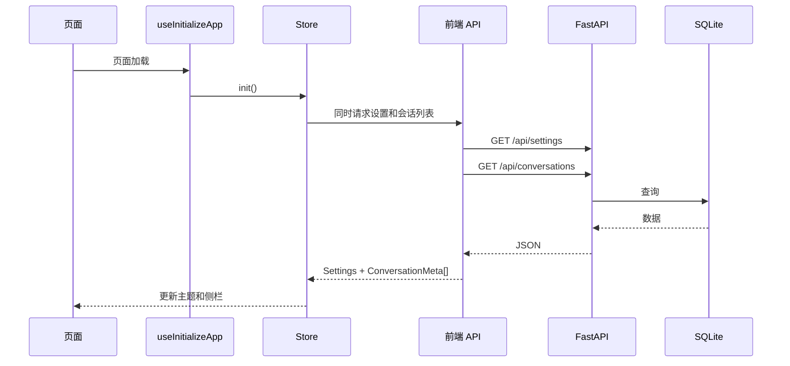
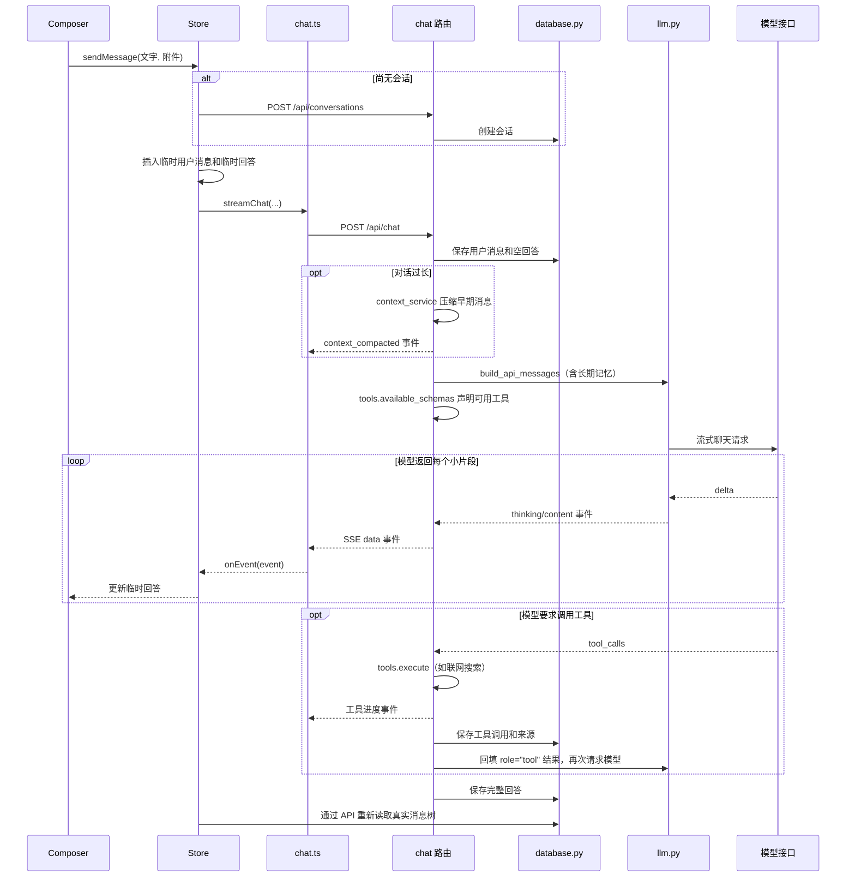

# 架构与数据流

本篇解释各模块为什么这样分，以及一次用户操作如何穿过整个项目。

## 1. 总体结构



每一层只承担一种职责：

- Electron 外壳：开窗口、托盘、按前端选中的渠道临时切换后端凭据，以及注入桌面端专属界面。
- 页面组件：显示内容、收集点击和输入。
- Store：记录全站状态，编排一项操作需要的多个步骤。
- 前端 API：知道 URL、请求方式和数据编码。
- 后端路由：验证外部输入，选择要调用的服务。
- 数据库和服务模块：执行真正的数据或模型工作。

这样拆分后，换一个按钮样式不需要理解数据库，修改 SQL 也不需要碰 React 页面。

### 桌面外壳与源码的关系

业务代码全在本目录（`origin resource`），Electron 外壳在同级的 `source` 目录，两者的分工要记清楚，否则很容易改错地方：

- `source/desktop/main.cjs`：主进程。开窗口、管托盘、拉起后端 exe 并分配端口、解析这次该用哪条 API 渠道（1.2.16 起只解析一条，不再失败轮换，见 07 §3）。
- `source/desktop/preload.cjs`：桥。把主进程能力以 `window.chatbotDesktop` 暴露给页面，页面不能直接碰 Node。
- `source/desktop/page-enhancements.js`：注入脚本。往 React 页面里加桌面端才有的界面，例如设置里的多 API 列表。
- `source/frontend/`：`frontend` 构建产物的副本，安装包实际加载的就是它。

前端改完要跑 `npm run build`，再把 `frontend/dist/` 同步到 `source/frontend/`，否则安装包里还是旧界面。

注入脚本靠 CSS 类名找位置，所以 React 那边的结构类名（例如设置弹窗里给注入点预留的 `.enh-settings-slot`）不能随手改名，改了就得同步改注入脚本。

## 2. 前端模块关系

### `app/`

`App.tsx` 是页面装配层。它决定侧栏、顶栏、错误提示、聊天模式、图片模式和设置弹窗怎样组合。`useInitializeApp.ts` 专门处理启动时后端可能尚未就绪的情况。

### `components/`

放多个功能都会使用的界面。当前侧栏同时服务聊天和图片历史，因此属于共享布局组件。

### `features/`

按用户能理解的功能分组。每个功能可以继续拥有自己的 `components`、`hooks`、`utils` 或测试目录。增加新功能时，优先在这里新建目录，避免把所有组件重新堆到一个文件夹。

### `services/api/`

按后端业务拆分：

- `http.ts`：统一状态码和错误处理。
- `settings.ts`：设置。
- `conversations.ts`：会话和分支。
- `uploads.ts`：附件。
- `chat.ts`：SSE 流式聊天。
- `images.ts`：图片任务和图片文件 URL。
- `index.ts`：统一导出，调用方不必知道具体文件名。

### `store/`

Store 是页面的“当前记忆”。它保存当前会话、消息树、设置、错误、弹窗状态和图片历史，也包含发送消息、删除会话等动作。

组件应尽量只订阅自己需要的字段，例如：

```ts
const streaming = useStore((state) => state.streaming)
```

不要在大型组件中无条件读取整个 Store，否则任何无关状态变化都可能让组件重新渲染。

### `types/`

类型是前后端数据约定的前端版本。后端字段更名时，先在这里更新，TypeScript 会帮助找到所有受影响代码。

## 3. 后端模块关系

### `main.py`

应用装配入口。它加载配置、初始化数据库、配置跨域并挂载路由。不要在这里增加具体业务接口。

### `routers/`

每个文件对应一组 URL。`routers/__init__.py` 的 `ALL_ROUTERS` 是路由总清单。新增路由模块后必须加入该列表，否则文件存在但接口不会生效。

### `database.py`

这是数据访问层。其他模块不应自行连接 SQLite 或散落 SQL。新增表或查询时集中写在这里。

### `llm.py`

负责把本地消息转换成 OpenAI 兼容格式、调用聊天接口、解析思考内容和正文、生成标题。它不负责 HTTP URL，也不直接更新页面。

### `web_search.py`

负责联网搜索。它不自己抓网页，而是把问题转交给 DeepSeek 的 Responses API，由服务端内置的 `web_search` 工具完成检索，再把结果整理成不可信证据上下文交给主模型。

搜索用的接口地址、密钥和模型在设置的“联网搜索”里单独配置，和主对话模型是两组独立配置：主对话走 `/chat/completions`，那里只能声明由客户端执行的函数工具；服务端内置搜索只挂在 `/responses` 上。

搜索结果始终当作不可信内容处理，只作为参考材料，不能当成指令执行。

### `memory.py` 与 `context_service.py`

`memory.py` 管长期记忆的读写和拼接。`context_service.py` 管上下文自动压缩：对话变长后把早期消息压成摘要，避免超出模型上下文长度。两者都只加工消息内容，不碰 HTTP 层。

### `tools.py` 与 `code_exec.py`

`tools.py` 声明可用工具并分发调用。`code_exec.py` 实现代码执行，默认关闭，是风险最高的开关，改动前先想清楚执行环境的边界。

### `files.py`

负责保存附件。图片被压缩为可发给模型的 data URL；PDF、Word 和文本文件被提取为文字。原始文件同时保留在上传目录。

### `images.py`

负责图片生成和编辑 API。接口可能返回 Base64 或临时 URL，本模块统一转成字节并保存在本地。

### `paths.py`

所有数据路径的唯一来源。新增缓存、导出或缩略图目录时，应先在这里定义。

## 4. 页面启动流程



如果后端晚于前端启动，请求会失败。初始化 Hook 每秒重试一次，最多约 15 秒。组件卸载时会清理计时器，避免后台继续重试。

桌面版由 Electron 主进程先拉起后端 exe、等它就绪后再打开窗口，所以正常情况下看不到重试；开发模式下前端常比后端先起来，重试就是为这种情况准备的。

## 5. 发送消息的完整流程



### 为什么需要临时消息

模型请求可能需要几秒才返回。如果页面等到数据库写完才显示，用户会觉得点击没有生效。Store 先用 `temp-user` 和 `temp-asst` 显示占位内容，再在结束后读取服务器数据替换它们。

不要让临时 ID 写入后端。临时消息只属于前端页面状态。

### 为什么最后要重新读取消息树

后端才拥有真实消息 ID、创建时间、模型名和最终数据库状态。流结束后重新读取可以纠正网络中断、分支变化或片段遗漏造成的前后端差异。

## 6. SSE 流式协议

聊天不是一次返回完整 JSON，而是持续返回：

```text
data: {"type":"thinking","text":"..."}

data: {"type":"content","text":"..."}

data: {"type":"done","content":"完整正文","thinking":"完整思考"}

```

两个换行表示一个事件结束。前端 `chat.ts` 维护 `buffer`，因为一次网络读取可能只拿到半个事件，也可能一次拿到多个事件。

事件类型：

| 类型 | 作用 |
|---|---|
| `start` | 告知真实用户消息和回答 ID |
| `context_compacted` | 早期消息被压缩，前端显示提示条 |
| `thinking` | 追加思考内容 |
| `content` | 追加可见回答 |
| `tool_start` | 模型开始调用某个工具，前端插入工具卡片 |
| `tool_progress` | 工具执行中的进度，例如正在搜索或打开网页 |
| `tool_end` | 工具执行完成，带回结果和来源 |
| `tool_error` | 工具执行失败，卡片显示错误但对话继续 |
| `turn_done` | 一轮模型输出结束，后面可能还有工具轮 |
| `done` | 整次请求结束，完整内容已落库 |
| `error` | 显示模型或网络错误 |
| `title` | 首条消息后刷新会话标题（截首句前 20 字，不调模型） |

`turn_done` 和 `done` 的区别值得留意：一次请求里模型可能先说几句、调用工具、再接着说，每轮说完发一个 `turn_done`，整件事全部结束才发 `done`。前端靠这个区分「还在忙」和「真的完了」。

## 7. 消息为什么是树

普通聊天可以看成一条直线，但“编辑旧问题”和“重新生成回答”会产生分支：

```text
用户问题 A
└─ 回答 A1
   └─ 用户问题 B
      ├─ 回答 B1
      └─ 回答 B2（重新生成）
```

每条消息只有一个 `parent_id`，指向上一个节点。一个节点可以被多条消息引用，因此形成树。

`active_leaf_id` 表示当前选择分支的最后一条消息。前端从它开始沿 `parent_id` 回溯，再反转数组，就得到屏幕上应显示的完整路径。

编辑用户消息时，新消息连接到原消息的父节点；重新生成回答时，新回答与旧回答共享同一个用户父节点。不要简单按创建时间展示全部消息，否则多个分支会混在一起。

## 8. 附件数据流

1. `Composer` 选择或粘贴文件。
2. `uploads.ts` 用 `FormData` 发送到 `/api/upload`。
3. `files.py` 保存原文件并判断类型。
4. 图片生成压缩预览；文档提取文字。
5. 后端返回 `Attachment`。
6. 发送聊天时，附件元数据随消息一起保存。
7. `llm.build_api_messages` 把文档文字放进 `<document>` 块，把图片放进 `image_url`。

默认最大上传文件是 30MB，限制位于 `backend/routers/uploads.py`。

## 9. 图片功能数据流

图片生成和图片编辑使用独立 API 地址和密钥。这样修改聊天模型配置不会影响图片模型。

生成结果先保存到 `backend/data/images/`，再把文件名数组写入数据库。页面通过 `/api/images/file/{name}` 读取文件，不直接暴露任意磁盘路径。

删除图片记录时，路由先从数据库得到文件名，再由 `images.delete_files` 清理磁盘文件。文件名会经过 `basename`，防止请求访问图片目录之外的文件。

## 10. 样式加载顺序

`styles/index.css` 按顺序导入样式文件。后导入的规则可以覆盖先导入的同名规则：

1. `base.css`：颜色变量、全局默认值、页面主布局。
2. `sidebar.css`：侧栏和顶栏。
3. `chat.css`：消息、Markdown、输入区。
4. `artifacts.css`：代码预览面板。
5. `settings.css`：设置弹窗基础规则。
6. `shared-components.css`：后期补充的共享组件规则。
7. `images.css`：模式切换和图片功能。

修改同名选择器前先全局搜索，因为规则可能在后加载文件中被覆盖。新增功能最好创建自己的 CSS 文件并在 `index.css` 中明确导入。

## 1.2.24 聊天状态约束

发送互斥覆盖创建会话、SSE 和最终刷新。停止只 abort，旧请求 finally 完成后才解锁。选择会话使用递增序号过滤过期响应；片段按 conversation id 写入。chatDrafts 按会话 id（空白页为 new）保存本次运行草稿；sendMessage 返回是否收到 start，Composer 仅在已接收后清除发送的草稿。
